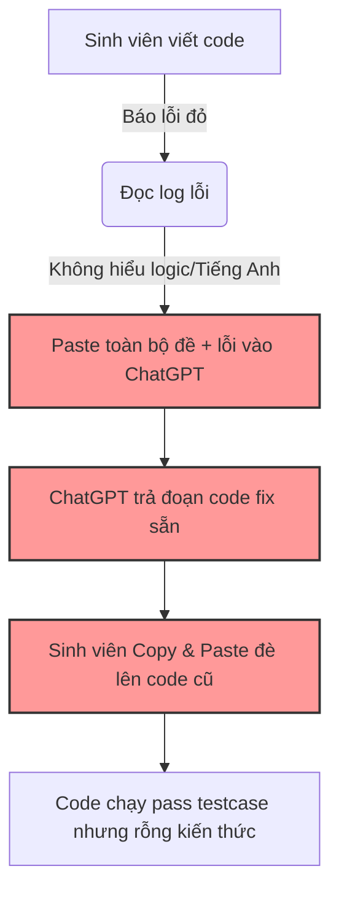
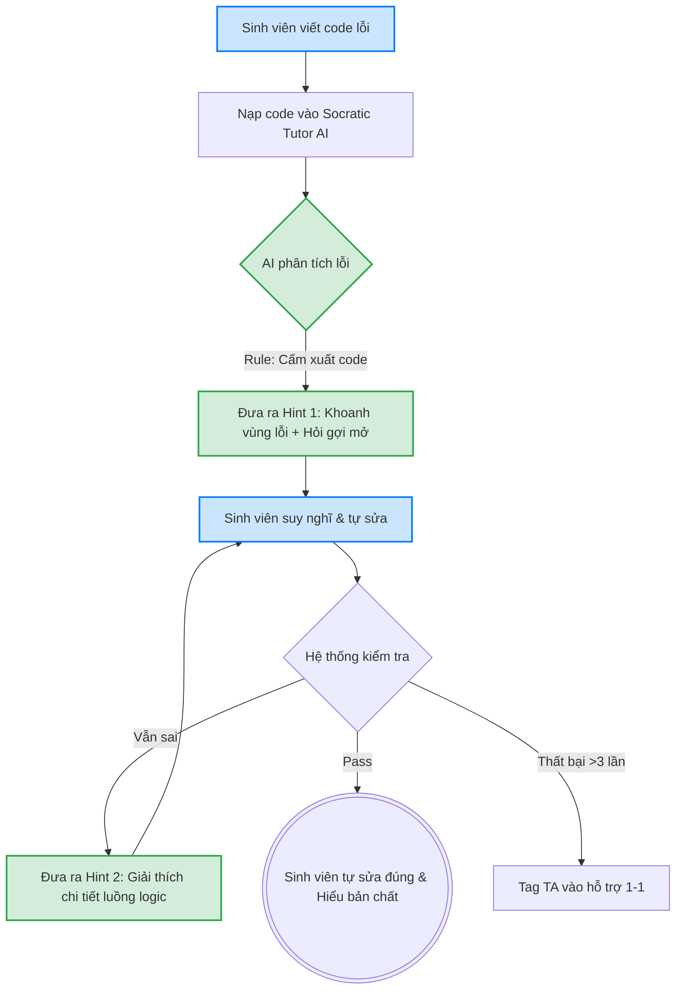

# Day 02 Lab — Worksheet

> File này là hướng dẫn chính cho toàn bộ lab 4 tiếng. Bộ gợi ý, hướng dẫn công cụ, prompt mẫu và checklist tự kiểm đã được đặt trực tiếp vào từng phase để bạn không phải nhảy qua nhiều file.

## Nguyên tắc

1. **Problem first, not AI first.** Đừng bắt đầu bằng chatbot/agent. Bắt đầu bằng actor, workflow, bottleneck, metric.
2. **Cá nhân scan rộng, nhóm hội tụ.** Mỗi người chuẩn bị nhiều candidate problems; nhóm chọn một candidate đáng đào sâu.
3. **Vẽ workflow trước khi chọn AI.** Nếu chưa thấy bước nào nghẽn, chưa được chọn Rule / Workflow / Agent.
4. **Không cần AI vẫn là kết luận tốt.** Điểm nằm ở chất lượng lập luận, không nằm ở độ "ngầu" của solution.
5. **AI hỗ trợ, không thay quyết định.** Dùng AI để hỏi ngược, phản biện, vẽ lại, research. Người học tự kiểm và tự chốt.
6. **Tự làm trước, AI sau.** Những phần thể hiện suy nghĩ cá nhân như pitch, challenge và reflection không được để AI viết thay.

## Repo nộp bài

Mỗi học viên nộp một repo cá nhân:

```text
Day02-MãHọcViên-HọVàTên/
├── README.md
├── 01-individual-problem-scan/
├── 02-group-problem-statement/
└── 03-individual-reflection/
```

File phụ như ảnh workflow, Mermaid, survey screenshot, research notes đặt cùng prefix:

```text
01-individual-problem-scan-workflow-card-1.png
02-group-problem-statement-workflow.pdf
02-group-problem-statement-research-notes.md
```

Lưu ý: `02-group-problem-statement/` là **bản nộp nhóm**. Nhóm 3-4 người làm chung một bản cuối, sau đó mỗi học viên copy bản này vào repo cá nhân của mình.

## Output cuối cùng

| Phần | Ai làm | Cần có gì |
|---|---|---|
| `01-individual-problem-scan/` | Cá nhân | 5+ problems, top 3 Problem Cards, draft workflow trước/sau cho top 3 |
| `02-group-problem-statement/` | Nhóm | Nhật ký hội tụ, kiểm chứng nhanh, research giải pháp, workflow trước/sau, Problem Statement v0/v1, Rule / Workflow / Agent, quyết định cuối |
| `03-individual-reflection/` | Cá nhân | Vai trò trong nhóm, cách dùng AI, học được gì, nếu làm lại sẽ đổi gì |

## Tiêu chí đánh giá nhanh

Chi tiết rubric nằm trong `README.md`. Bảng dưới đây giúp bạn biết phần nào đang ảnh hưởng tới điểm khi làm worksheet.

| Nhóm / cá nhân | Thành phần | Điểm |
|---|---|---:|
| Nhóm | Workflow trước/sau | 15 |
| Nhóm | Problem Statement + metric + boundary | 20 |
| Nhóm | Độ phù hợp với AI + phương án thay thế | 15 |
| Nhóm | Chất lượng quyết định Go / Not Yet / No-Go | 10 |
| Cá nhân | Scan problem + top 3 Problem Cards | 12 |
| Cá nhân | Tham gia pitch + challenge | 12 |
| Cá nhân | Reflection cá nhân | 10 |
| Cá nhân | Kiểm tra hiểu bài cá nhân | 6 |

Bonus tối đa +10 điểm:

- +3 nếu scan rộng hơn yêu cầu và vẫn cụ thể.
- +3 nếu tương tác tích cực trên Discord hoặc trong nhóm.
- +4 nếu kiểm chứng/research vượt yêu cầu và giúp nhóm sửa lại problem, metric hoặc quyết định cuối.

## Quy ước dùng AI trong lab

| Phần | Có thể dùng AI không? | Cách dùng đúng |
|---|---|---|
| Scan cá nhân | Có, sau khi tự scan trước | Hỏi thêm góc nhìn, rồi tự chọn ý nào là pain thật. |
| Problem Card | Có | Dùng AI để phản biện, không để AI tự bịa problem thay mình. |
| Pitch + challenge | Không dùng để nói/thay mình | Trình bày và phản biện bằng hiểu biết của bản thân. |
| Research | Có | Dùng AI/search để tìm nguồn, nhưng phải kiểm link và ghi rõ giả định chưa chắc. |
| Workflow | Có | Có thể dùng AI/Mermaid để vẽ lại flow, nhưng phải tự kiểm từng bước. |
| Reflection | Không dùng để viết thay | Có thể dùng AI để gợi ý câu hỏi tự soi, nhưng câu trả lời phải là trải nghiệm thật của mình. |

## Gợi ý công cụ nhanh

| Phase | Tool có thể dùng | Dùng để làm gì | Lưu ý |
|---|---|---|---|
| Phase 1 | ChatGPT / Claude / Gemini, Google, review app/forum | Gợi ý thêm problem nếu bí | Tự scan trước; bỏ ý không có trải nghiệm thật. |
| Phase 2 | ChatGPT / Claude | Phản biện Problem Card | Prompt rõ: "chỉ ra điểm yếu, đừng khen". |
| Phase 4 | Google, Perplexity, tài liệu chính thức, survey/interview nhanh | Kiểm chứng pain, tìm giải pháp đã có | Không dùng số liệu nếu không kiểm được nguồn. |
| Phase 5 | Giấy/bảng, Mermaid, Excalidraw, FigJam | Vẽ workflow trước/sau | Vẽ tay cho rõ tư duy trước, số hóa sau nếu cần nộp đẹp hơn. |
| Phase 6 | ChatGPT / Claude | Hỏi phản biện Rule / Workflow / Agent | Không để AI chốt thay. Nhóm phải tự quyết định. |
| Phase 7 | Không bắt buộc | Chỉ dùng để gợi ý câu hỏi tự soi | Không copy reflection do AI viết. |

---

# Phase 0 — Worked Example (15')

Mở `02-deliverable-example.md` để xem một bài hoàn chỉnh. Khi đọc, chú ý:

- cá nhân scan rộng như thế nào,
- top 3 Problem Cards cụ thể ra sao,
- nhóm hội tụ từ nhiều candidates về một bài như thế nào,
- research giải pháp giúp nhóm tránh nghĩ trong chân không ra sao,
- workflow trước/sau thể hiện bottleneck, boundary và phương án quay về nếu AI sai như thế nào,
- Problem Statement v0/v1 khác nhau ở đâu.

Self-check:

- [ ] Tôi hiểu nhóm chỉ chọn **candidate problem**, không chọn ngay Problem Statement.
- [ ] Tôi hiểu deep-dive gồm validation, research, workflow, metric, PS và AI decision.

---

# Phase 1 — Individual Scan: tìm 5+ problems (25')

## Mục tiêu

Mỗi người scan rộng ít nhất 5 problems từ trải nghiệm thật. Đây là phần phân kỳ cá nhân.

Bonus:

- 8+ problems: bonus nếu vẫn cụ thể.
- 10+ problems: bonus tốt nếu đa dạng lăng kính và có dấu hiệu thật.
- Không bonus cho list dài nhưng toàn ý chung chung.

## 4 lăng kính để scan

Một problem có thể rơi vào nhiều lăng kính. Không cần phân loại hoàn hảo ở bước này. Dùng lăng kính để mở rộng quan sát, rồi bước sau mới filter.

| Lăng kính | Câu hỏi gợi mở | Ví dụ |
|---|---|---|
| **Lặp lại** | Việc gì cứ xuất hiện đều đặn mỗi ngày/tuần/tháng?<br>Nếu phải làm thêm 10 lần nữa, phần nào tôi muốn chuẩn hóa hoặc tự động hóa?<br>Người mới vào có phải hỏi lại cùng một quy trình không? | Báo cáo tuần, nhập liệu, tổng hợp câu hỏi |
| **Tốn thời gian** | Việc gì mỗi lần làm đều nặng, dù không nhất thiết xảy ra thường xuyên?<br>Thời gian mất ở đâu: tìm thông tin, đọc hiểu, tổng hợp, chờ người khác, format, hay sửa lại?<br>Nếu giảm 50% thời gian thì có đáng kể không? | Đọc tài liệu dài, tìm quyết định cũ, review PRD |
| **AI có thể tốt hơn** | Việc gì cần hiểu ngữ cảnh, đọc/viết ngôn ngữ, phân loại, so sánh, tổng hợp hoặc gợi ý đúng lúc?<br>Nếu AI chỉ hỗ trợ một bước trong workflow, bước nào đáng hỗ trợ nhất?<br>Nếu AI sai ở bước đó thì hậu quả là gì? | Search tài liệu, gợi ý next step, tóm tắt nhiều nguồn |
| **Pain từ người khác** | Ai ngoài tôi đang bị kẹt hoặc phàn nàn lặp lại?<br>Họ thường nói câu gì, hỏi lại điều gì, hoặc bỏ sót bước nào?<br>Có dấu hiệu thật không: ticket, Slack/Discord, comment, survey, phản hồi trực tiếp? | Hỏi lại deadline, không hiểu task, support ticket lặp lại |

Cách phân biệt nhanh:

- `Lặp lại` bắt đầu từ câu hỏi: việc này xảy ra bao nhiêu lần?
- `Tốn thời gian` bắt đầu từ câu hỏi: mỗi lần làm tốn bao nhiêu công?
- Một problem vừa lặp lại vừa tốn thời gian thì càng đáng đưa vào danh sách scan.

Nếu bí, tự hỏi:

- Tuần trước tôi mất nhiều thời gian nhất vào việc gì?
- Việc gì tôi hay trì hoãn vì nhàm chán hoặc rối?
- Người khác hay hỏi tôi câu gì lặp lại?
- Có workflow nào ở trường/công ty ai cũng biết là chậm?
- Có app nào tôi dùng và thường nghĩ "giá như nó hiểu mình hơn"?

Một số điểm bắt đầu dễ quan sát:

| Bối cảnh | Có thể nhìn vào đâu? | Câu hỏi gợi mở |
|---|---|---|
| Học tập | Bài tập, tài liệu, deadline, câu hỏi lặp lại trong lớp | Phần nào làm tôi mất thời gian vì phải đọc, tổng hợp, hỏi lại hoặc đoán ý? |
| Công việc / thực tập | Báo cáo, họp, handoff, ticket, review, nhập liệu | Việc nào lặp lại đủ nhiều nhưng vẫn cần hiểu ngữ cảnh trước khi xử lý? |
| Nhóm / CLB / dự án | Phân công, theo dõi tiến độ, feedback, tổng hợp quyết định | Chỗ nào mọi người hay hiểu khác nhau hoặc bỏ sót việc cần làm? |
| Sản phẩm đang dùng | Search, onboarding, support, form, notification | Điểm nào user phải tự nối nhiều thông tin rời rạc để hoàn thành việc? |

## Ngân hàng gợi ý problem

Nếu vẫn bí ý tưởng, đọc nhanh các gợi ý dưới đây rồi quay lại trải nghiệm thật của bạn. Không copy nguyên văn; hãy viết lại theo người dùng, workflow và dấu hiệu thật mà bạn quan sát được.

| Bối cảnh | Gợi ý problem để suy nghĩ |
|---|---|
| Học tập | Tìm lại quyết định/câu trả lời cũ trong Discord; đọc tài liệu dài trước deadline; không biết bài nộp thiếu field nào; ôn tập từ nhiều nguồn rời rạc. |
| Đời sống cá nhân | Theo dõi chi tiêu rải rác nhiều app; lên kế hoạch đi lại/ăn uống cho nhóm; tổng hợp giấy tờ cá nhân; nhắc việc định kỳ nhưng hay quên context. |
| Thực tập / công việc mới | Hỏi lại quy trình onboarding; tìm người phụ trách đúng việc; viết update hằng tuần; hiểu task từ nhiều Slack/thread/tài liệu. |
| Người đi làm | Tổng hợp báo cáo tuần; chuẩn bị meeting recap; review tài liệu dài; phân loại ticket/support; tìm quyết định cũ trước khi làm tiếp. |
| Cải thiện sản phẩm đang dùng | Search kém; onboarding khó hiểu; notification không đúng lúc; form dài và dễ nhập sai; support phải hỏi lại cùng một thông tin nhiều lần. |

## Bảng scan

| # | Lăng kính | Problem quan sát được | Ai đang đau? | Dấu hiệu thật |
|---|---|---|---|---|
| 1 | | | | |
| 2 | | | | |
| 3 | | | | |
| 4 | | | | |
| 5 | | | | |
| 6 | | | | |
| 7 | | | | |
| 8 | | | | |
| 9 | | | | |
| 10 | | | | |

Gợi ý cho `Dấu hiệu thật`: mất bao lâu, xảy ra mấy lần/tuần, bao nhiêu người gặp, có log/ticket/review/comment không, nếu không sửa thì hậu quả là gì.

## Nếu dùng AI ở phase này

Tự scan trước rồi mới hỏi AI.

Prompt gợi ý:

```text
Tôi là [vai trò] trong [bối cảnh].
Công việc hằng tuần gồm: [...]

Tôi đã nghĩ ra các vấn đề sau:
1. [...]
2. [...]
3. [...]

Hãy gợi ý thêm problem theo 4 lăng kính: lặp lại, tốn thời gian, AI có thể tốt hơn, pain từ người khác.
Với mỗi gợi ý, ghi actor, workflow sơ bộ và cách đo.
Đừng đưa ý tưởng quá rộng kiểu "xây trợ lý AI toàn năng".
```

Ghi vào reflection: AI gợi ý gì dùng được, ý nào bị bỏ vì không phải pain thật.

---

# Phase 2 — Top 3 Problem Cards + draft workflow (35')

## Mục tiêu

Từ 5+ problems, mỗi người chọn top 3 để chuẩn bị share với nhóm. Mỗi top problem cần có:

- Problem Card.
- Draft current workflow.
- Draft future workflow.
- Lý do vì sao bài này có impact.

## Chọn top 3

Tiêu chí chọn:

- Actor rõ.
- Workflow hiện tại có thể vẽ được.
- Bottleneck cụ thể.
- Impact có thể đo hoặc ước lượng.
- Có thể so sánh No AI / Rule / Workflow / Agent.
- Không quá rộng cho một buổi lab.

| Rank | Problem | Vì sao chọn | Điều còn chưa chắc |
|---|---|---|---|
| 1 | | | |
| 2 | | | |
| 3 | | | |

## Problem Card template

Lặp lại template này cho top 3.

Nếu cần một bản nhìn nhanh để pitch với nhóm, dùng dạng card này:

```text
┌──────────────────────────────────────────────┐
│ PROBLEM CARD #___                            │
│                                              │
│ Problem 1 câu: ___________________________   │
│                                              │
│ Ai đang đau? _____________________________   │
│                                              │
│ Workflow hiện tại:                           │
│ 1. ______ → 2. ______ → 3. ______ → 4. ___   │
│                                              │
│ Bước nghẽn nhất: ________  (___ phút/lần)    │
│                                              │
│ Đo thành công bằng gì? ___________________   │
│ Ví dụ: giảm 90 phút → dưới 30 phút           │
│                                              │
│ Quick gut: □ No AI □ Rule □ Workflow         │
│            □ Agent □ Chưa biết               │
└──────────────────────────────────────────────┘
```

Phần nộp chi tiết vẫn dùng template bên dưới để không thiếu field.

```text
Problem 1 câu:

Actor:

Thời điểm / bối cảnh:

Current workflow 3-7 bước:
1.
2.
3.
4.
5.

Bottleneck:

Impact:

Success metric:

Non-AI alternative:

AI hypothesis:

Quick gut:
[ ] No AI / process fix
[ ] Rule
[ ] Workflow
[ ] Agent
[ ] Chưa biết
```

## Draft workflow cho mỗi top problem

Workflow có thể là ảnh, ASCII hoặc Mermaid. Không cần đẹp, nhưng phải đọc được.

Ví dụ ASCII:

```text
CURRENT STATE — 90 phút

[Export Jira: 10']
→ [Lấy metrics: 10']
→ [Đọc Slack: 15']
→ [Tổng hợp: 15']
→ [Viết narrative: 25']  <-- bottleneck
→ [Review: 10']
→ [Gửi: 5']

FUTURE STATE — 21 phút

[Auto-pull: 2']
→ [AI cấu trúc dữ liệu: 1']
→ [AI draft narrative: 1']
→ [PM review + edit: 15']  <-- human boundary
→ [PM gửi: 2']

Fallback: AI draft tệ → PM tự viết lại
```

Nếu nộp file riêng, đặt tên như:

```text
01-individual-problem-scan-workflow-card-1.png
```

## Chọn card muốn pitch nhất

Card tôi muốn pitch nhất:

```text

```

Vì sao:

```text

```

Câu hỏi tôi muốn nhóm challenge:

```text

```

## Nếu dùng AI ở phase này

Prompt phản biện:

```text
Đây là Problem Card của tôi:
[dán card]

Hãy đóng vai skeptical product manager và phản biện:
1. Actor có đủ cụ thể không?
2. Workflow có thật không?
3. Bottleneck có rõ chưa?
4. Metric có đo được không?
5. Rule/process fix đã đủ chưa?
6. Tôi có đang nhảy sang Agent quá sớm không?

Trả lời ngắn, tập trung vào điểm yếu.
```

---

# Break (10')

# **Phase 3 — Group Convergence: từ 9-12 candidates về 1 (30')**


* ## **Bước 3.1 — Trình bày top 3**


* Nhóm 4 người, mỗi người trình bày 3 candidates, tổng cộng 12 candidates.


| \# | Người đưa ra | Candidate problem | Người gặp vấn đề | Điểm nghẽn | Cảm nhận nhanh |
| :---- | :---- | :---- | :---- | :---- | :---- |
| 1 | Trần Duy Anh | Viết CV ứng tuyển chuẩn kỹ thuật cho sinh viên | Sinh viên ngành kỹ thuật | Tự viết mô tả chi tiết dự án (chuẩn STAR) và căn chỉnh format | Workflow |
| 2 | Trần Duy Anh | Điều phối luồng giao thông tại nút giao | Cán bộ CSGT, chuyên viên quy hoạch | Thử nghiệm thực địa gây ùn tắc, đứng đếm xe thủ công | Workflow |
| 3 | Trần Duy Anh | Gán nhãn dữ liệu ảnh Object Detection | Kỹ sư AI, Data Labeler | Vẽ bounding box và gán nhãn thủ công gây mỏi mắt, sai sót | Workflow |
| 4 | Đỗ Nhật Minh | Chấm và cộng điểm tương tác tự động | Trợ giảng (TA) và Học viên | Đọc dò tay từng dòng log chat và đối chiếu tên hiển thị | Workflow |
| 5 | Đỗ Nhật Minh | Hỗ trợ cài đặt môi trường và sửa lỗi Lab | Học viên mới và Trợ giảng (TA) | Chờ TA rảnh để đọc tin và ping-pong lấy bối cảnh máy | Workflow |
| 6 | Đỗ Nhật Minh | Giải đáp tự động quy định khóa học | Học viên, TA, BTC | TA lặp lại việc lục tìm link và gõ lại câu trả lời cũ | Workflow |
| 7 | Nguyễn Tuấn Phong | Giải thích logic & Debug (Vibe code chuẩn) | Học viên (đặc biệt là non-tech) | Bế tắc tự sửa và chọn cách copy code AI/bạn bè | Workflow |
| 8 | Nguyễn Tuấn Phong | Xử lý FAQ & Giảm tải cho Trợ giảng | Học viên & Lab Coach | Học viên chờ lâu, TA lặp lại công việc tay chân rep tin | Workflow |
| 9 | Nguyễn Tuấn Phong | Tổng hợp thông tin & Link phân tán | Học viên | Cuộn tìm Discord và lục lọi Outlook Mail mất thời gian | Workflow |
| 10 | Nguyễn Hữu Đức | Khó truy cập học liệu | Sinh viên mới nhập học | Thao tác tìm kiếm đúng tài liệu đa nền tảng dễ nhầm lẫn | Workflow |
| 11 | Nguyễn Hữu Đức | Thiếu trợ giảng hỗ trợ không kịp | Sinh viên trong giờ lab/assignment | Coach không đủ, thời gian chờ hỗ trợ quá lâu | Agent |
| 12 | Nguyễn Hữu Đức | Nhắc nhở deadline chưa hiệu quả | Sinh viên nhiều lớp/deadline | Không có hệ thống nhắc việc, lỡ/trôi thông báo | Workflow |


* ## **Bước 3.2 — Gom trùng / cluster**


| Cluster | Candidates included | Pattern chung | Ghi chú |
| :---- | :---- | :---- | :---- |
| A. Hỗ trợ gỡ lỗi & Lab | 5, 7, 11 | Học viên kẹt kỹ thuật nhưng TA phản hồi chậm, dẫn đến mất gốc/nản chí. | Gom chung vì đều xoay quanh trải nghiệm thực hành Lab và thiếu hụt TA. |
| B. Quản lý thông tin & Hỏi đáp | 6, 8, 9, 10, 12 | Học viên hỏi đi hỏi lại hoặc miss thông tin phân tán; TA quá tải đóng vai "tổng đài viên". | Cùng giải bài toán truy xuất thông tin (RAG/FAQ) và cảnh báo. |
| C. Tối ưu tác vụ thủ công lặp lại | 3, 4 | Dùng mắt và tay thao tác hàng trăm lần (dò điểm, vẽ khung ảnh) dễ sai sót. | Rõ ràng về metric thời gian nhưng mức độ tư duy (reasoning) của AI thấp. |
| D. Tác vụ chuyên môn sâu | 1, 2 | Cần chuyên môn ngành hẹp (đánh giá CV chuẩn ATS, mô phỏng giao thông). | Scope khá lớn so với một bài thực hành Lab ngắn hạn. |


* ## **Bước 3.3 — Shortlist**


* Nhóm chọn ra 3 candidates có workflow rõ nét nhất đại diện cho các cluster.


| Candidate | Vì sao vào shortlist | Rủi ro / điều chưa rõ |
| :---- | :---- | :---- |
| 1\. Giải thích logic & Debug (Vibe code chuẩn) | Workflow cụ thể (có human boundary rõ: ép học viên tự code lại). Pain point lớn nhất trong giáo dục. | Làm sao thiết kế Prompt Socratic Tutor đủ chặt để AI không "nhả" thẳng code cho học viên copy? |
| 2\. Chấm và cộng điểm tương tác tự động | Workflow rất tĩnh và tuyến tính (Batch processing), thời gian tính bằng phút dễ đo đếm. | Rủi ro AI map sai tên do nickname giống nhau; có thể fix nhanh bằng Rule vận hành thay vì AI. |
| 3\. Viết CV kỹ thuật chuẩn ATS | Nỗi đau thực tế chạm đến đầu ra việc làm. Có thể so sánh trước/sau rõ ràng. | Khó kiểm chứng ngay lập tức Metric "điểm ATS \> 80" hoặc tỷ lệ pass vòng gửi xe trong khuôn khổ làm Lab. |


* ## **Bước 3.4 — Score để đồng thuận**


* Chấm 1-5.


| Candidate | Actor rõ | Workflow rõ | Pain có evidence | Impact đo được | Làm trong lab | So sánh R/W/A được | Nhóm hiểu domain | Tổng |
| :---- | :---- | :---- | :---- | :---- | :---- | :---- | :---- | :---- |
| **Giải thích logic & Debug** | 5 | 5 | 5 | 5 | 5 | 5 | 5 | **35** |
| Chấm điểm tương tác | 5 | 5 | 4 | 5 | 4 | 5 | 4 | 32 |
| Viết CV kỹ thuật | 4 | 4 | 3 | 4 | 4 | 4 | 4 | 27 |


* Candidate nhóm chọn:  


* Giải thích logic & Debug (Vibe code chuẩn) của Nguyễn Tuấn Phong.  


Vì sao chọn:  


* 1\. Vấn đề cực kỳ sát sườn: Học viên nộp bài chạy được nhờ copy AI nhưng rỗng kiến thức là bài toán nhức nhối nhất của mô hình bootcamp.  
* 2\. Thiết kế workflow có "Human boundary" rất chuẩn (AI chỉ gợi ý lỗi, học viên phải tự sửa).  
* 3\. Metric rõ ràng (giảm gỡ lỗi từ 20' xuống 5', tỷ lệ hiểu bài \>70%).  
* 4\. Rất dễ build prototype bằng một Workflow AI (Socratic Prompt) ngay trong buổi Lab để kiểm chứng ngay.  


 Vì sao không chọn các candidate còn lại:  


* 1\. Chấm điểm tương tác: Bài toán giải quyết tốt thời gian cho TA, nhưng phần lõi lại là "đếm và so khớp chuỗi". Nhóm nhận định rủi ro có thể fix hoàn toàn bằng Rule (bắt đổi tên đúng format) và script, AI không thực sự tỏa sáng ở đây.  
* 2\. Viết CV kỹ thuật: Rất tiềm năng nhưng tốn nhiều thời gian để dựng context mô tả dự án thô của sinh viên và khó đánh giá được độ chính xác của chuẩn ATS ngay trong lớp học.  
 
Nếu có disagreement, nhóm xử lý thế nào:  


* Có thành viên đề xuất hướng "Agent giải đáp thắc mắc tự động" (bài FAQ) vì tính ứng dụng cao. Tuy nhiên, sau khi đối chiếu với tiêu chí "Độ mơ hồ/Độ phức tạp" của Phase 6 trong worksheet, nhóm đồng thuận rằng bài toán "Giải thích logic & Debug" dưới dạng Workflow sẽ an toàn, dễ kiểm soát Human Boundary hơn (bot tự trả lời FAQ dễ bịa thông tin sai lệch dẫn đến hậu quả lớn về vận hành). Nhóm chốt quay về Workflow Debug.  


\# **Phase 4 — Quick Validation \+ Research giải pháp**


## **Bước 4.1 — Quick validation**


Để xác thực vấn đề học viên kẹt lỗi code và phụ thuộc vào AI/bạn bè, nhóm đã thực hiện kết hợp cả phỏng vấn nhanh (Option A) và khảo sát nhóm nhỏ (Option B) với các học viên non-tech trong lớp.


### **Khảo sát nhanh (Micro survey / Discord poll)**


Nhóm đã hỏi 10 học viên thường xuyên gặp khó khăn trong giờ thực hành Lab và thu được kết quả sau:


* **Bạn có gặp vấn đề này không?** 9/10 bạn xác nhận có rơi vào tình trạng bí lỗi và phải đi copy code.  
* **Tần suất?** Rất thường xuyên, khoảng 2-3 lần mỗi tuần (gần như mọi buổi Lab).  
* **Bước nào đau nhất?** Bước đọc log lỗi đỏ lòm trên màn hình nhưng không hiểu nó đang báo cái gì, trong khi TA đang bận support bạn khác.  
* **Hiện bạn workaround thế nào?** Copy toàn bộ đề bài và code đang viết dở ném vào ChatGPT để lấy code mới chạy cho nhanh kịp giờ nộp.  
* **Mức độ đáng giải quyết (1-5)?** 4.8/5. Việc copy khiến các bạn bị hổng kiến thức khi làm bài tập lớn.


### **Phỏng vấn sâu (Quick interviews)**


Nhóm phỏng vấn 2 học viên và 1 TA để đào sâu hơn về hành vi này:


* **Lần gần nhất bạn gặp vấn đề này là khi nào?** "Ngay chiều qua lúc làm bài Lab vòng lặp. Bị kẹt lỗi cú pháp gần 30 phút."  
* **Bạn đang xử lý bằng workflow nào?** "Cố tự dò lỗi \-\> Search Google \-\> Nhắn hỏi TA nhưng TA bận \-\> Sắp hết giờ nộp nên nhờ ChatGPT giải hộ luôn."  
* **Nếu tốt hơn, bạn muốn điều gì thay đổi?** "Mình muốn có người (hoặc tool) chỉ cho mình biết mình đang tư duy sai ở đâu, hoặc lỗi ở dòng nào để mình tự sửa, chứ đưa code sẵn thì mình không học được gì."


### **Bảng tổng hợp kết quả Validation**


| Nguồn | Số người / số mẫu | Tín hiệu xác nhận | Tín hiệu phản bác | Nhóm sửa problem thế nào |
| :---- | :---- | :---- | :---- | :---- |
| Discord Poll | 10 | 90% học viên xác nhận phải dùng ChatGPT giải hộ vì áp lực thời gian nộp Lab. | 10% (các bạn background IT) cho biết họ tự debug được bằng cách search StackOverflow, không cần tool hỗ trợ. | Nhóm làm rõ lại Actor: Tập trung tuyệt đối vào "Học viên non-tech / người mới bắt đầu", không áp dụng cho học viên đã có nền tảng vững. |
| Quick Interview | 2 Học viên | Học viên thừa nhận việc copy code AI là do "sợ trễ deadline" và "TA phản hồi quá chậm", không phải vì lười suy nghĩ. | Học viên e ngại nếu dùng AI Tutor mà nó lại giải thích dài dòng, lan man thì thà đi copy còn hơn. | Bổ sung Boundary/Constraint cho AI: AI Tutor phải giải thích cực kỳ ngắn gọn, khoanh vùng đúng dòng code bị lỗi và tuyệt đối không được sinh ra code hoàn chỉnh. |
| Quick Interview | 1 Trợ giảng (TA) | TA xác nhận thời gian kẹt lỗi của các bạn non-tech thường kéo dài 20-30 phút/case, gây quá tải hệ thống hỗ trợ. | TA lo ngại AI có thể gợi ý sai hướng (hallucination) khiến học viên càng sửa càng nát code. | Thêm bước Fallback vào Workflow: Nếu học viên làm theo gợi ý của AI Tutor 2 lần vẫn báo lỗi, bắt buộc phải tag TA vào xử lý trực tiếp. |


## Bước 4.2


Dưới đây là nội dung phần **Bước 4.2 — Research giải pháp đã có** được thiết kế dưới dạng bảng chuẩn chỉnh, bám sát đúng bài toán "Socratic Tutor" (Tránh bẫy Vibe Code) của bạn.  
Mình đã chọn lọc ra 3 case study kinh điển nhất trên thế giới về mảng AI hỗ trợ học lập trình để bạn đưa vào bài nộp:


| Nguồn / tool / case | Link | Họ giải quyết phần nào? | Điểm mạnh | Khoảng trống / rủi ro | Bài học cho nhóm |
| :---- | :---- | :---- | :---- | :---- | :---- |
| **CS50 Duck (Harvard CS50)** | [CS50's Duck Debugger](https://cs50.harvard.edu/x/2023/honesty/) | Xử lý bước 3 (Debug). Nhận mã lỗi và giải thích khái niệm, chỉ dẫn sinh viên tìm lỗi. | Được thiết kế cực tốt bằng System Prompt để **tuyệt đối không viết code** thay sinh viên (bảo vệ Academic Honesty). | Context (ngữ cảnh) bị giới hạn trong phạm vi khóa CS50. Nếu hỏi ra ngoài chương trình, bot từ chối trả lời. | **Pattern tuyệt vời:** Cần thiết lập System Prompt cực kỳ chặt chẽ (Hard-rule) để ép AI đóng vai trò người gợi ý, cấm cung cấp code trực tiếp. |
| **Khanmigo (Khan Academy)** | [Khanmigo Socratic AI](https://www.khanacademy.org/khan-labs) | Hỗ trợ giải bài tập qua phương pháp Socratic (hỏi ngược lại học sinh). | Đặt câu hỏi định hướng tư duy rất khéo, buộc người học phải tự động não (Ví dụ: *"Bạn nghĩ dòng 5 đang làm gì?"*). | Trải nghiệm đôi khi quá dài dòng. Khi sinh viên đang bị ép deadline, việc AI hỏi ngược lại quá nhiều vòng gây ức chế. | **Bài học ranh giới:** Không nên lạm dụng hỏi ngược quá nhiều. AI Tutor của nhóm chỉ nên gợi ý 1-2 vòng, nếu học viên vẫn "bí" thì Fallback (đẩy sang Trợ giảng thật). |
| **GitHub Copilot / Cursor IDE** | [GitHub Copilot Chat](https://github.com/features/copilot) | Xử lý bước 3 & 4 (Phát hiện lỗi và sinh code tự động). | Context-aware cực mạnh. Biết chính xác toàn bộ file code và môi trường học viên đang làm. | **Đây chính là Anti-pattern của bài toán:** Nó nhả code ăn sẵn quá nhanh, cổ xúy thói quen "Vibe code" mù quáng mà không hiểu bản chất. | **Tránh vết xe đổ:** Không tích hợp AI trực tiếp vào IDE để sinh code. Buộc học viên phải copy lỗi thả vào một cửa sổ Chat riêng biệt để nhận giải thích lý thuyết. |


# Phase 5 — Workflow + Problem Statement (45')


## Bước 5.1 — Current workflow bản nhóm





| Bước | Actor | Input | Output | Thời gian/tần suất | Ghi chú |
| --- | --- | --- | --- | --- | --- |
| 1. Viết code & gặp bug | Sinh viên năm nhất | Đề bài thực hành | Code bị lỗi, console báo đỏ | 15-30 phút | Thường xuyên bế tắc ở các bài tập vòng lặp, mảng. |
| 2. Đọc Log | Sinh viên năm nhất | Bảng console lỗi | Sự bối rối, hoang mang | 5-10 phút | Log quá phức tạp, sinh viên non-tech không biết khoanh vùng dòng lỗi. |
| 3. Cầu cứu AI | Sinh viên năm nhất | Copy đoạn code + Log | Hỏi ChatGPT: "Sửa lỗi này cho tôi" | 1 phút | Lựa chọn dễ dàng nhất khi TA bận. |
| 4. Nhận Code | ChatGPT | Prompt copy thô của SV | Đoạn code đã fix hoàn chỉnh | 10 giây | AI phục vụ tận răng, bypass quá trình suy nghĩ. |
| 5. Submit | Sinh viên năm nhất | Code giải sẵn | Bài chạy pass testcase | 1 phút | Gây hổng kiến thức nghiêm trọng. |


**Bottleneck chính:**
Bước 3 và 4: Bước cầu cứu AI và nhận code giải sẵn. Đây là "điểm gãy" của quá trình học tập. Thay vì phải rèn luyện tư duy gỡ lỗi (debug), sinh viên chọn con đường ngắn nhất là copy/paste, dẫn đến việc hoàn thành "nghĩa vụ nộp bài" nhưng hoàn toàn thất bại ở "mục tiêu cốt lõi" là hiểu logic lập trình.


---


## Bước 5.2 — Future workflow bản nhóm





**Before/after impact:**


| Metric | Trước | Sau kỳ vọng | Ghi chú |
| --- | --- | --- | --- |
| Số bước học tập chủ động | 2 (Viết code, Đọc log) | 4-5 bước (Tham gia hỏi đáp, tự gõ lại code) | Quá trình học dài hơn một chút nhưng đi sâu vào bản chất. |
| Tỷ lệ tương tác thành công | Không đo được | > 80% case tự fix được lỗi dưới 3 lượt (turns) chat với bot | Leading metric (đo lường được ngay trong buổi Lab). |
| Thời gian gỡ 1 lỗi cơ bản | 20-30 phút (kẹt, hỏi TA) | < 5 phút (hỏi Tutor) | Tăng tốc độ phản hồi nhưng vẫn giữ được não bộ hoạt động. |
| Bottleneck chính | Lệ thuộc ChatGPT giải bài | Phụ thuộc vào chất lượng câu hỏi của Socratic Tutor | Nếu AI hỏi quá mơ hồ, SV sẽ nản và lén dùng ChatGPT ngoài. |
| Risk mới | Không có | Sinh viên Prompt Injection (lừa bot cấp code) | Boundary: Phải cài đặt System Prompt chống jailbreak cực mạnh. |


---


## Bước 5.3 — Problem Statement v0


| Field | Nội dung |
| --- | --- |
| **Actor** | Sinh viên năm nhất (non-tech) học môn lập trình cơ sở, chưa có nền tảng tư duy thuật toán và yếu kỹ năng đọc log lỗi. |
| **Workflow** | (Hiện tại) Viết code → Gặp lỗi đỏ → Không hiểu log → Copy toàn bộ thả vào ChatGPT giải hộ → Copy code giải sẵn đè vào bài nộp → Pass testcase nhưng không hiểu gì. |
| **Bottleneck** | Bước đọc log lỗi và tự gỡ rối (debug). Sinh viên bế tắc nên chọn đường tắt copy code từ AI/bạn bè để kịp deadline vì TA không hỗ trợ kịp thời. |
| **Impact** | Sinh viên vượt qua các bài Lab thực hành nhưng hổng kiến thức trầm trọng, dẫn đến tỷ lệ trượt cao (thường >40%) ở bài thi viết tay/thi vấn đáp cuối kỳ, sinh ra tâm lý sợ code. |
| **Success Metric** | - Thời gian trung bình để sinh viên tự debug thành công một lỗi sau khi nhận gợi ý giảm từ 20 phút xuống dưới 5 phút.<br>


<br>- Tỷ lệ sinh viên nộp bài thành công sau tối đa 3 lượt (turns) hỏi gợi ý từ bot đạt >80%. |
| **Boundary** | - Tuyệt đối KHÔNG xuất ra mã nguồn hoàn chỉnh ở bất kỳ ngôn ngữ nào.<br>


<br>- Mã giả (pseudocode) bị giới hạn: chỉ dùng ngôn ngữ tự nhiên mô tả bước logic, không dùng cú pháp cấu trúc (`if/else`, `for`, `while`).<br>


<br>- Phải tích hợp System Prompt chống Prompt Injection (VD: "Tôi là giảng viên...", từ chối mọi yêu cầu in ra code). |


# Phase 6 — Rule / Workflow / Agent + Decision (25')


## Bước 6.1 — So sánh Rule / Workflow / Agent


| Mức | Phương án cho bài toán nhóm | Khi nào đủ | Rủi ro | Chọn? |
|---|---|---|---|---|
| **Rule** | Dùng regex chặn từ khóa "code" trong prompt hoặc output để cấm chatbot sinh mã. | Nếu chỉ muốn cấm bot một cách cứng nhắc. | Không giúp gì cho sinh viên khi bị kẹt logic, sinh viên sẽ nản và bỏ đi tìm tool khác. | Không |
| **Workflow** | AI đóng vai trò Socratic Tutor trong 1 phiên chat (multi-turn). Cố định luồng: SV nhập lỗi → AI dựa trên System Prompt phân tích và đặt câu hỏi gợi mở → SV trả lời/sửa → Lặp lại. | Hỗ trợ tương tác tuyến tính qua lại. AI xử lý tốt ngôn ngữ tự nhiên và giữ bối cảnh trong một phiên chat. | Sinh viên dùng thủ thuật (prompt injection) ép bot nhả code giải sẵn. Cần System Prompt cực kỳ chặt chẽ. | **Chọn** |
| **Agent** | AI tự động truy cập vào môi trường code của SV, tự chạy test case, tự phân tích lỗi và tự động lên kế hoạch mớm bài học theo lịch sử năng lực của từng em. | Khi cần một hệ thống AI hoàn toàn tự trị, phối hợp nhiều công cụ bên ngoài (tool use). | Over-engineering (làm phức tạp hóa vấn đề không cần thiết). Tốn kém tài nguyên và vượt quá phạm vi của một buổi lab. | Không |


Mức chọn:


```text
Workflow (Kết hợp Rule/Guardrails ở khâu kiểm duyệt output).


```


Vì sao chọn:


```text
Việc AI đóng vai trò Tutor hỏi - đáp với sinh viên bản chất là một quy trình tương tác đa lượt (multi-turn), không yêu cầu AI tự gọi các công cụ bên ngoài hay tự lên kế hoạch phức tạp. Mức Workflow hoàn toàn đáp ứng được tính linh hoạt trong ngữ cảnh chat, đồng thời dễ kiểm soát rủi ro hơn rất nhiều so với Agent.


```


## Bước 6.2 — Problem Statement v1


| Field | Nội dung |
| --- | --- |
| **Actor** | Sinh viên năm nhất (non-tech) học môn lập trình cơ sở, thường có xu hướng bỏ cuộc và copy code khi gặp lỗi. |
| **Workflow** | Viết code bị lỗi → Gửi code/log cho Socratic Tutor (AI) → AI phân tích và đặt câu hỏi gợi mở → SV phản hồi/tự sửa code → Lặp lại đến khi hiểu bản chất. |
| **Bottleneck** | Sự cám dỗ của việc có đáp án ngay lập tức từ các tool AI bên ngoài làm thui chột năng lực tự gỡ rối (debug) của sinh viên. |
| **Impact** | Cải thiện triệt để kỹ năng giải quyết vấn đề tự lực (problem-solving), triệt tiêu thói quen học vẹt, copy mù quáng. |
| **Success Metric** | - Tỷ lệ sinh viên nộp bài thành công sau tối đa 3-4 lượt tương tác gợi ý từ bot đạt > 80%.<br>


<br>- Thời gian trung bình để tự gỡ lỗi thành công giảm từ 20 phút xuống < 5 phút. |
| **Boundary** | Guardrails chặt chẽ: Hệ thống kiểm duyệt output bằng Rule, tuyệt đối không xuất raw code hoàn chỉnh. Chỉ cho phép văn bản tự nhiên hoặc pseudo-code siêu ngắn. |
| **AI intervention point** | Can thiệp ngay tại bước sinh viên đọc log lỗi console mà không hiểu, bế tắc không biết sửa từ đâu. |
| **Mức chọn** | Workflow |
| **Rủi ro & người thật kiểm tra** | Rủi ro: AI hỏi quá lan man khiến sinh viên bực mình. Người thật kiểm tra: Tích hợp nút Thumbs up/down cho mỗi câu trả lời của AI để thu thập feedback tự động từ sinh viên, thay vì bắt TA phải đi đọc lại toàn bộ log chat thủ công. |


## Bước 6.3 — Final decision


| Câu hỏi | Yes / Not Yet / No | Ghi chú |
| --- | --- | --- |
| Actor và workflow đã rõ chưa? | Yes | Rõ ràng. Sinh viên - Bug - Socratic Tutor - Tự Fix. |
| Baseline và success metric đã đo được chưa? | Yes | Đo qua thời gian debug trung bình và số lượt chat (turns) để giải quyết lỗi. |
| Có data/input đủ dùng chưa? | Yes | Có thể lấy log lỗi thực tế từ các bài nộp của sinh viên khóa trước. |
| Nếu AI sai, hậu quả có chấp nhận được không? | Yes | Nếu AI hỏi sai, SV sẽ phàn nàn hoặc vote down, không gây hậu quả thảm họa hệ thống. |
| Có người review/owner vận hành không? | Yes | Giảng viên/TA thu thập feedback (Thumbs up/down) để điều chỉnh System Prompt hàng tuần. |
| Có cách non-AI đơn giản hơn không? | No | Thuê lượng lớn TA trực 24/7 để Socratic với từng SV là bất khả thi về chi phí. |


Decision:


```text
Go
```


Lý do:


```text
Bài toán giải quyết trúng "nỗi đau" lớn nhất của giáo dục lập trình hiện đại. Workflow rõ ràng, rủi ro được cô lập tốt bằng Boundary cứng (chặn code), dễ tạo dữ liệu test và chứng minh được giá trị tư duy logic của AI.
```


Nếu Go, pilot nhỏ nhất là:


```text
Xây dựng một chatbot nhỏ trên nền tảng nội bộ. Nhập input là 1 bài tập kinh điển (Vd: Tìm chuỗi Palindrome) và 1 đoạn code có lỗi logic phổ biến. Mời 5 sinh viên yếu kỹ năng debug dùng thử Socratic Tutor để sửa lỗi. Đo lường thời gian hoàn thành và phỏng vấn nhanh cảm nhận của họ.
```

# Phase 7 — Individual Reflection (15')

## Tôi đã tham gia vào phần nào?

| Hoạt động | Tôi đã làm gì? | Kết quả / ảnh hưởng |
|---|---|---|
| Scan cá nhân | Pitch 3 problems thiên về kỹ thuật sâu (CV, Traffic, AI Labeling). | Cung cấp góc nhìn đa dạng, tuy nhiên scope hơi rộng. |
| Challenge bài của bạn khác | Phản biện trực tiếp bài "Vibe Code" của Phong về việc làm sao đo lường được "100% không copy code". | Nhóm nhận ra lỗ hổng metric và đổi sang đo "số lượt hỏi đáp thành công dưới 3 lượt". |
| Research | Tìm kiếm các giải pháp tương tự trên thế giới (CS50 Duck, Khanmigo, Github Copilot). | Rút ra bài học cốt lõi: Copilot là Anti-pattern, CS50 Duck là Role-model. |
| Workflow nhóm | Hoàn thiện code Mermaid và chuẩn hóa bảng Input/Output. | Sơ đồ thể hiện rõ ràng các bottleneck và luồng đi của data. |
| Problem Statement | Rà soát lại các field, đặc biệt là Impact và Success Metric. | PS trở nên thực tế hơn, không bị ngợp bởi các metric phi thực tế. |

## Bảng dùng AI trong reflection

| Phase | Tôi dùng AI để làm gì? | AI hữu ích ở đâu? | AI sai/hời hợt ở đâu? | Tôi sửa gì bằng nhận định của mình? |
|---|---|---|---|---|
| Scan | Tìm các nỗi đau thường gặp của sinh viên kỹ thuật. | Đưa ra được framework phân tích STAR cho CV. | AI gợi ý bài toán "Tự động code hộ sinh viên". | Bỏ qua vì nó đi ngược với triết lý giáo dục. |
| Research | Nhờ AI (Perplexity) tìm kiếm các công cụ AI trong giáo dục lập trình có trích dẫn nguồn. | Tìm được case CS50 Duck của Harvard rất sát với ý tưởng nhóm. | AI hallucinate (bịa ra) một vài số liệu hiệu quả của CS50. | Tự click vào link nguồn để verify lại thông tin, chỉ lấy phương pháp luận chứ không lấy số ảo. |
| Problem Statement | Nhờ AI đóng vai PM phản biện PS v0 của nhóm. | Chỉ ra lỗi nhầm lẫn giữa Impact (hậu quả hiện tại) và Goal (kỳ vọng tương lai). | Câu chữ AI sửa nghe rất máy móc và dài dòng. | Tự viết lại bằng ngôn ngữ tự nhiên, tập trung vào "nỗi đau trượt môn". |

## Reflection câu hỏi mở

- **Tôi học được gì khi nghe top 3 problems của các bạn khác?** Bài toán hay không phải là bài toán dùng công nghệ "xịn" nhất (như bài nhận diện giao thông của tôi), mà là bài toán có thể đo lường và triển khai nhanh nhất trong khuôn khổ Lab.
- **Nhóm có lúc nào bị solution-first không?** Lúc chọn mức độ AI, mọi người rất thích chữ "Agent". Tôi cũng bị cuốn theo vì nghe nó ngầu, nhưng sau đó phải tỉnh táo kéo nhau về Workflow.


## Tự kiểm cuối bài

- [x] [12đ cá nhân] Cá nhân có 5+ problems và top 3 Problem Cards.
- [x] [12đ cá nhân] Tôi đã pitch rõ và challenge nhóm đúng trọng tâm.
- [x] Nhóm có nhật ký hội tụ từ candidates về 1 bài.
- [x] [15đ nhóm] Nhóm có workflow trước/sau.
- [x] [20đ nhóm] Nhóm có Problem Statement v0/v1 với metric và boundary rõ.
- [x] [15đ nhóm] Nhóm có so sánh No AI / Rule / Workflow / Agent.
- [x] [10đ nhóm] Nhóm có Go / Not Yet / No-Go và lý do rõ.
- [x] [10đ cá nhân] Reflection cá nhân có nói rõ vai trò trong nhóm, cách dùng AI, điều học được và nếu làm lại sẽ đổi gì.
- [x] [6đ cá nhân] Tôi tự giải thích được mạch problem → workflow → metric → boundary → độ phù hợp với AI.

---

*Day 02 Lab — Worksheet*
